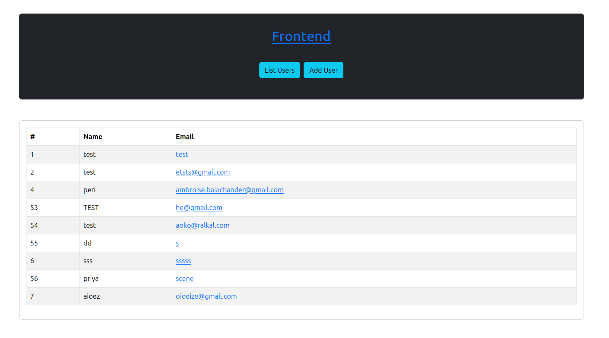
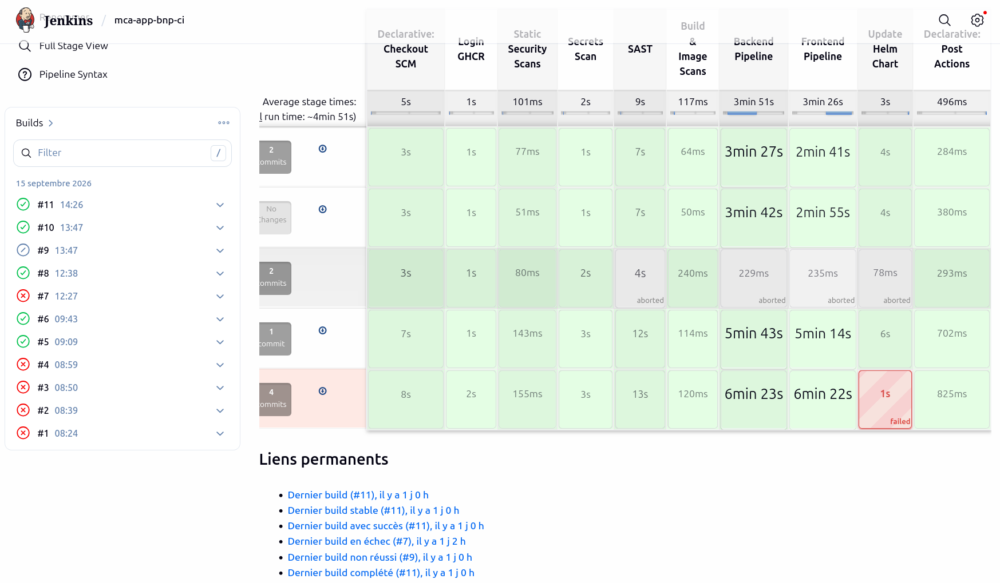
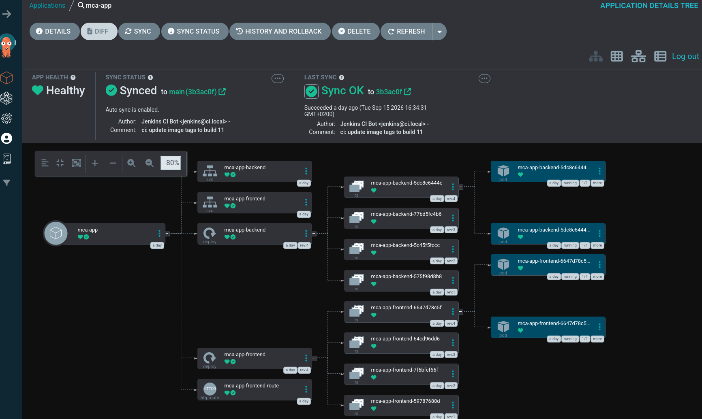

# SOLUTION.md — Test technique DevOps MCA

## 1. Vue d'ensemble de l'architecture

L'application (backend Spring Boot, frontend Angular, base PostgreSQL) est déployée sur un cluster **Kubernetes Talos** provisionné localement via **Incus** (VMs), l'ensemble étant géré en Infrastructure as Code avec **OpenTofu/Terraform**.

```
                         ┌───────────────────────────────────┐
                         │      Cluster Kubernetes (Talos)     │
                         │   1 control-plane + 2 workers       │
                         │   (VMs Incus sur laptop Ubuntu)     │
                         └───────────────────────────────────┘
Internet/LAN ──> MetalLB (IP externe) ──> Traefik (Gateway API)
                                                │
                    ┌───────────────┬───────────┼───────────┬────────────┐
                    ▼               ▼           ▼           ▼            ▼
              app.local   jenkins.local  argocd.local traefik.local 
              (Angular+nginx)   (Jenkins CI)   (ArgoCD)   (Dashboard)
                    │
                    ├── /api/*  ──> backend (Spring Boot)
                    │
                    └── backend ──> CloudNativePG (PostgreSQL, opérateur)
```

### Composants déployés

| Composant | Rôle | Outil |
|---|---|---|
| Cluster K8s | Orchestration | **Talos Linux** (1 CP + 2 workers, VMs Incus) |
| Provisioning infra | IaC | **OpenTofu** (providers `lxc/incus`, `siderolabs/talos`) |
| Stockage | StorageClass dynamique | `local-path-provisioner` |
| Base de données | PostgreSQL managé | **CloudNativePG** (opérateur) |
| LoadBalancer | IP externe sur bare-metal | **MetalLB** (mode L2) |
| Ingress | Routage HTTP | **Traefik** (Gateway API : `Gateway` + `HTTPRoute`) |
| CI | Build, scan sécurité, push | **Jenkins** (agent `buildah` personnalisé) |
| CD | Déploiement GitOps | **ArgoCD** (sync auto depuis `helm-charts/`) |
| Registre de prod | Images finales | **GHCR** (GitHub Container Registry) |

### Sécurité / DevSecOps intégrée au pipeline

- **gitleaks** — scan de secrets (backend + frontend)
- **Semgrep** — SAST
- **Syft** — génération de SBOM (format CycloneDX)
- **Grype** — scan de vulnérabilités (SCA + image), **bloquant** avant tout push si une faille critique est détectée
- **Remédiation des CVE** : Suite aux alertes remontées par les scans, mise à jour des versions dans le pom.xml (Spring Boot 4.1.1 et Tomcat 10.1.58) pour corriger les CVE critiques constatées.
- Images **Chainguard** (distroless / non-root) pour backend et frontend, réduisant la surface d'attaque
- `imagePullSecrets` pour l'authentification au registre privé GHCR

---

## 2. Étapes de build

Le build est entièrement automatisé via le pipeline Jenkins (`Jenkinsfile` à la racine du repo) :

1. **Login GHCR** (credentials Jenkins `ghcr-credentials`)
2. **Scans statiques en parallèle** : gitleaks (secrets) + Semgrep (SAST) sur `backend/` et `frontend/`
3. **Build & scan par service** (backend et frontend en parallèle) :
   - `buildah build` → image locale
   - Export en `oci-archive` (fichier local, pas encore publié)
   - `syft` → génération du SBOM
   - `grype --fail-on critical` → scan de vulnérabilités ; **le pipeline s'arrête ici si une faille critique est trouvée, avant toute publication**
   - `buildah push` → publication vers GHCR (`ghcr.io/ambroisebalachander/mca-backend-bnp` et `mca-frontend-bnp`)

Les images de base :
- **Backend** : multi-stage `cgr.dev/chainguard/maven` (build) → `cgr.dev/chainguard/jre` (runtime)
- **Frontend** : multi-stage `cgr.dev/chainguard/node` (build Angular) → `cgr.dev/chainguard/nginx` (runtime, avec `nginx.conf` custom pour le fallback SPA et les chemins temporaires compatibles non-root)

### Build manuel (reproduction locale)

```bash
# Backend
cd backend
buildah build --tag ghcr.io/ambroisebalachander/mca-backend:local .

# Frontend
cd frontend
buildah build --tag ghcr.io/ambroisebalachander/mca-frontend:local .
```

---

## 3. Étapes de déploiement

### 3.1 Provisionner l'infrastructure (Talos sur Incus)

```bash
cd infra/infra-cluster
tofu init
tofu apply
```

Récupérer les accès au cluster :
```bash
tofu output -raw kubeconfig > ~/talos-cluster/kubeconfig
tofu output -raw talosconfig > ~/talos-cluster/talosconfig
export KUBECONFIG=~/talos-cluster/kubeconfig
kubectl get nodes
```

### 3.2 Déployer le socle (stockage, base de données)

```bash
cd ../infra-k8s
tofu init
tofu apply
```
(installe `local-path-provisioner`, l'opérateur CloudNativePG, et le `Cluster` PostgreSQL avec les credentials `myapplication`/`M3P@ssw0rd!` imposés par l'énoncé)

### 3.3 Déployer les briques réseau et outillage (MetalLB, Traefik, registre, Jenkins, ArgoCD)

```bash
cd ../../k8s
kubectl apply -f metallb-pool.yaml
kubectl apply -f registry.yaml
kubectl apply -f jenkins-route.yaml
kubectl apply -f argocd-route.yaml
kubectl apply -f registry-ui-route.yaml
kubectl apply -f traefik-dashboard-route.yaml
```

Ajouter les hostnames locaux à `/etc/hosts` (pointant vers l'IP MetalLB de Traefik, ex. `10.82.125.200`) :
```
10.82.125.200 jenkins.local
10.82.125.200 argocd.local
10.82.125.200 registry.local
10.82.125.200 traefik.local
10.82.125.200 app.local
```

### 3.4 Déployer l'application (GitOps via ArgoCD)

```bash
kubectl apply -f argocd-app.yaml
```

ArgoCD synchronise automatiquement les manifests du chart `helm-charts/` (backend, frontend, `HTTPRoute`) depuis le repo Git — tout changement poussé sur `main` est déployé automatiquement (`selfHeal`, `prune` activés).

Vérifier l'état :
```bash
kubectl get application mca-app -n argocd
kubectl get pods -n mca-app
```

### 3.5 Accéder à l'application

`http://app.local` → liste des users (`/users`), formulaire d'ajout (`/adduser`), le tout servi par Angular/nginx avec les appels `/api/*` routés vers le backend Spring Boot par la même `HTTPRoute` (même origine, pas de CORS à gérer).

---

## 4. Captures d'écran

*(capture du frontend sur `http://app.local/users` montrant la liste des utilisateurs non vide)*


*(capture du jenkins sur `http://jenkins.local/` montrant la CI*


*(capture du argocd sur `http://jenkins.local/` montrant la CD*


---

## 5. Bonus réalisés

- ✅ **Pipeline CI complet** avec agent Jenkins `buildah` personnalisé (image dédiée avec gitleaks/semgrep/syft/grype préinstallés)
- ✅ **GitOps avec ArgoCD** (au-delà du CI demandé)
- ✅ **Scans de sécurité intégrés et bloquants** (gitleaks, Semgrep, Grype) avant toute publication d'image
- ✅ **SBOM** généré à chaque build (CycloneDX)
- ✅ **Infrastructure 100% as Code** (OpenTofu) — cluster Kubernetes inclus, pas seulement l'application
- ✅ **CD** via ArgoCD car c'est le standard de déploiement avec GitOPS plutot que Ansible

---

## 6. Notes techniques

- **StorageClass** : Talos ne fournit aucun provisionneur de stockage par défaut ; `local-path-provisioner` a été installé et défini comme `StorageClass` par défaut.
- **Registre privé GHCR** : les manifests de déploiement référencent `imagePullSecrets: github-registry-secret` pour authentifier le pull des images privées.
- **Gateway API** plutôt qu'Ingress classique : le contrôleur `ingress-nginx` étant en fin de maintenance (retiré depuis mars 2026), Traefik est configuré en mode Gateway API (`Gateway`/`HTTPRoute`), l'approche recommandée par la communauté Kubernetes.